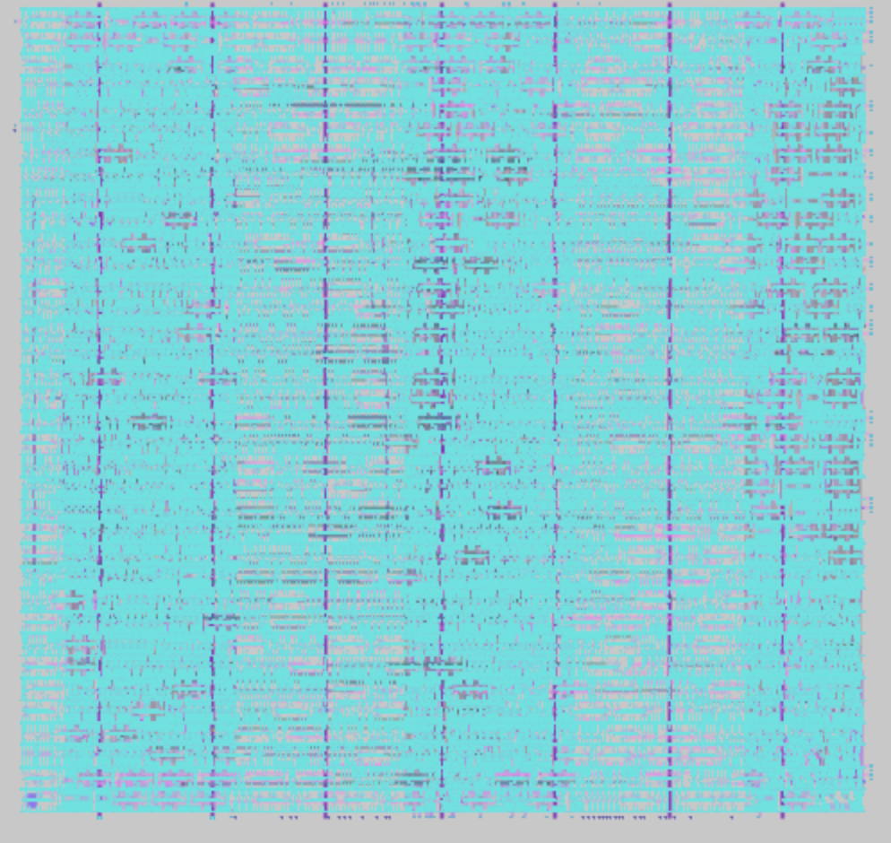

# Physical Design Implementation of Serial Peripheral Interface Using Qflow

**Author**: K Azaan Ahamed  
**Specialization**: VLSI Physical Design  
**Target Technology**: OSU018 (180 nm) Standard Cell Library  
**Toolchain**: Qflow Open-Source Digital ASIC Flow (Yosys, GrayWolf, Qrouter, Magic, Netgen, OpenSTA)



---

## 📌 Project Overview

This project executes a complete end-to-end **RTL-to-GDSII ASIC physical design flow** for a synchronous Serial Peripheral Interface (SPI) master controller (`spi_top.v`). The backend implementation was performed using the open-source **Qflow** digital synthesis and layout toolchain mapped to the Oklahoma State University 0.18 µm (`osu018`) process library.

The design flow validates every stage of digital chip backend implementation:
1. **RTL Logic Synthesis & Technology Mapping**: `Yosys`
2. **High Fanout Net Synthesis (HFNS)**: `blifFanout`
3. **Standard Cell Placement & Floorplanning**: `GrayWolf`
4. **Pre-Route Static Timing Analysis (STA)**: `OpenSTA`
5. **Detailed Multi-Layer Routing**: `Qrouter`
6. **Post-Route Timing Sign-off**: `OpenSTA`
7. **Physical Verification (DRC & LVS)**: `Magic` & `Netgen`
8. **Silicon-Ready Mask Generation**: GDSII Stream Format

---

## 🏗️ RTL Architecture (`spi_top.v`)

The core implements a full-duplex synchronous SPI master controller:
- **8-bit Transmit/Receive Shift Registers**: Serializes output bytes on `mosi` and deserializes inputs on `miso`.
- **Configurable SPI Modes**: Programmable Clock Polarity (`CPOL`) and Clock Phase (`CPHA`).
- **Programmable Clock Divider**: Synthesizes synchronous serial bus clock (`sclk`) from system clock.
- **Hardware Status Flags**: `busy` line for arbitration and single-cycle `done` strobe upon 8-bit frame completion.

---

## 🛠️ Step-by-Step Qflow Physical Design Flow

| Phase | Tool | Function & Key Output | Status |
|---|---|---|---|
| **1. Preparation** | Qflow Manager | Target library configuration (`osu018`), directory tree generation | Completed |
| **2. Synthesis** | Yosys | Verilog RTL parsing, gate-level netlist generation (`.blif`) | Completed |
| **3. Fanout Optimization** | blifFanout | Buffer insertion for high fanout nets | Completed |
| **4. Placement** | GrayWolf | Simulated annealing cell placement, density & wirelength minimization | Completed |
| **5. Pre-Route STA** | OpenSTA | Setup and hold timing slack verification | Met |
| **6. Detailed Routing** | Qrouter | Multi-layer maze router (Metal1 to Metal3) | 100% Routed |
| **7. Post-Route STA** | OpenSTA | Parasitic-aware timing sign-off | Met |
| **8. Migration & DRC** | Magic | Design Rule Checking against scalable CMOS design rules | 0 Violations |
| **9. LVS Verification** | Netgen | Layout vs. Schematic netlist topology equivalence | Clean Match |
| **10. GDSII Generation** | Magic / Qflow | Production layout stream (`.gds`) ready for fabrication | Generated |

---

## 🖼️ Physical Design Artifacts & Layout Visuals

All post-synthesis, placement, and routing snapshot figures are documented in [`assets/`](assets/):
- **Synthesized Gate Architecture**: [`assets/image10.png`](assets/image10.png)
- **Cell Placement Grid (GrayWolf)**: [`assets/image14.png`](assets/image14.png)
- **Clock Tree & Route Density**: [`assets/image17.png`](assets/image17.png)
- **DRC & LVS Clean Layout**: [`assets/image19.png`](assets/image19.png)
- **Final Silicon Mask Layout (GDSII)**: [`assets/image22.png`](assets/image22.png)

---

## 📄 Project Report

The complete academic course project submission report is included in [`docs/`](docs/):
- [SPI_Qflow_Physical_Design_Report.docx](docs/SPI_Qflow_Physical_Design_Report.docx) — Detailed 20+ page physical design report containing theoretical background on Qflow, step-by-step terminal outputs, timing constraint definitions, and DRC/LVS verification transcripts.

---

## 🚀 Directory Structure

```
├── README.md
├── docs/
│   └── SPI_Qflow_Physical_Design_Report.docx
├── rtl/
│   └── spi_top.v
├── tb/
│   └── spi_top_tb.v
└── assets/
    ├── image1.png ... image22.png
```
